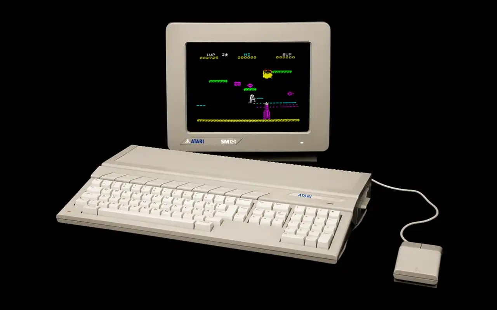

# MD/ZX: ZX Spectrum emulator for the Atari ST



Microfirmware for the [SidecarTridge Multi-device](https://sidecartridge.com) by [Neil Rackett](https://x.com/neilrackett)

## Introduction

MD/ZX turns your SidecarT into a ZX Spectrum 48K running on your Atari ST!

Any game in `.z80` format can be played using the Atari ST keyboard or a joystick, just drop them into the `/zx` folder of your SD card.

Don't have any games yet? Don't worry, MD/ZX comes with a built-in demo.

Ported from Andre Weissflog's [`chips`](https://github.com/floooh/chips), via Salvatore Sanfilippo's [zx2040](https://github.com/antirez/zx2040), so a massive thank you to both of them for their fantastic work!

## Controls

The whole Atari ST keyboard maps onto the Spectrum, positionally: letters,
digits and punctuation are 1:1, **Shift** is Caps Shift, **Alternate** is
Symbol Shift, **Backspace** / **Delete** are Delete, and **Caps Lock** is
Caps Lock.

| Context | Key                               | Action                                                                       |
| ------- | --------------------------------- | ---------------------------------------------------------------------------- |
| Play    | Letters / digits                  | Spectrum keys, 1:1                                                            |
|         | `. , ; ' / - =`                   | Same symbol (Symbol Shift applied for you)                                    |
|         | Shift / Alternate                 | Caps Shift / Symbol Shift                                                     |
|         | Caps Lock                         | Caps Lock                                                                    |
|         | Backspace / Delete                | Delete                                                                       |
|         | ↑ ↓ ← →                           | Kempston joystick — or the Spectrum cursor keys, via the **cursor** setting  |
|         | Insert / Clr Home                 | Fire (only when **cursor** is set to the Kempston joystick)                   |
|         | ESC                               | Open the menu                                                                |
| Menu    | ↑ ↓                               | Choose a game or setting                                                      |
|         | ← →                               | Change the selected setting                                                  |
|         | Return / Space / Insert / Clr Home | Select                                                                       |
|         | ESC                               | Close the menu                                                               |

A real ST joystick works as Kempston too, and is combined with the cursor keys.
Choose **exit** in the menu to quit back to GEM.

## Installation

1. Download the latest `.uf2` and `.json` from the [releases page](https://github.com/neilrackett/md-zx/releases).
2. Copy both files to the `/apps` folder of your SidecarT's microSD card.
3. Optionally, copy your `.z80` Spectrum games into a `/zx` folder on the same microSD card.
4. On the Booster screen, press ESC for the app list and select MD/ZX.
5. To return to Booster, power on your ST while holding the SELECT button on your SidecarT.

## Hardware requirements

- [SidecarTridge Multi-device](https://sidecartridge.com) (RP2040-based ROM cartridge emulator)
- Atari ST, STE, MegaST, or MegaSTE (low or medium resolution — high-res falls back to GEM)
- A microSD card for your games
- Raspberry Pi Debug Probe or Picoprobe for flashing/debugging (optional, for development)

## Games

Any games in `.z80` format are supported, just copy them into the `/zx` folder on your SD card for MD/ZX to find them; there are loads of classic games currently available on [Internet Archive](https://archive.org/details/zx_spectrum_tosec_set_september_2023) if you don't have any already.

On first boot, if `/zx` has no games in it, MD/ZX seeds a small demo (`3dshow_demo.z80`) so there's always something in the menu.

## How it works

The RP2040 runs the full Spectrum on Core 0 and decodes its video memory straight into the framebuffer; the m68k blits that to the ST screen every VBL. Input and audio ride the cartridge bus in both directions.

```
IKBD keyboard bytes ──$FB82xx──►   demux → Spectrum keys / Kempston
                                             Core 1: chunky → ST planar (c2p)
Timer-B: write YM volumes      ◄──$FA4100── beeper → (vA,vB) pairs, filled per VBL
```

MD/ZX runs almost entirely on the SidecarT, with the ST providing the screen, keyboard and sound.

## Building

```bash
# Production build (pico_w) — uses uuid.txt / APP_UUID_KEY
make build

# Debug build (bumps the patch version)
make debug

# Open a UART console on the debug probe
make uart
````

For more on coding for the SidecarT, [the docs are here](https://docs.sidecartridge.com/sidecartridge-multidevice/programming/).

## License

Source code is licensed under the GNU General Public License v3.0. See [LICENSE](LICENSE) for the full text. The vendored emulator core (`rp/src/zx/`) retains its original MIT / zlib licences.
